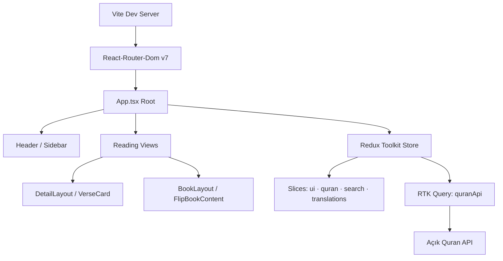

<!-- PROJECT LOGO -->
<br />
<div align="center">
  <a href="https://deepmushaf.web.app/">
    
  </a>

  <h1 align="center">Quran Web Application</h1>

  <p align="center">
    An open-source Quran reader built with modern web technologies, featuring a 3D page-flipping mushaf layout, multiple translations, and integrated audio recitations.
    <br />
    <a href="https://deepmushaf.web.app/"><strong>Explore the Live Demo »</strong></a>
    <br />
    <br />
    <a href="#-features">View Features</a>
    ·
    <a href="https://github.com/0memo07/Quran-Web-Application/issues">Report Bug</a>
    ·
    <a href="https://github.com/0memo07/Quran-Web-Application/issues">Request Feature</a>
  </p>
</div>

<!-- BADGES -->
<div align="center">


</div>

<!-- TABLE OF CONTENTS -->
<details>
  <summary>Table of Contents</summary>
  <ol>
    <li><a href="#-about-the-project">About The Project</a></li>
    <li><a href="#-features">Features</a></li>
    <li><a href="#-architectural-highlights">Architectural Highlights</a></li>
    <li><a href="#-directory-structure">Directory Structure</a></li>
    <li>
      <a href="#-getting-started">Getting Started</a>
      <ul>
        <li><a href="#prerequisites">Prerequisites</a></li>
        <li><a href="#installation">Installation</a></li>
      </ul>
    </li>
    <li><a href="#-contributing">Contributing</a></li>
    <li><a href="#-license">License</a></li>
  </ol>
</details>

---

## 🌟 About The Project

Building a high-quality, performant, and accessible web-based Quran reader. The project emphasizes a clean UI/UX, robust state management, and separation of concerns to provide a seamless reading experience.

### ✨ Features

- **3D Page-Flipping:** GPU-accelerated page turning powered by `react-pageflip`. Pages auto-scale to the viewport (single card on mobile, double spread on desktop).
- **Integrated Audio Engine:** Stream Quran recitations seamlessly via the HTML5 Audio API, including play/pause, time scrubbing, and verse-highlight synchronization.
- **Incremental Data Prefetching:** Zero-latency browsing. Upcoming Surahs are fetched silently in the background and cached before you flip the page.
- **Internationalisation (i18n):** Full English and Turkish support. UI language switches instantly without reloads and persists across sessions.
- **Shareable Read State:** Reading state (Surah ID, page number, translator) is synced to the URL, making every session directly shareable.
- **Security & Accessibility:** All Quran texts and annotations are XSS sanitized via `DOMPurify`. The app is completely accessible and responsive.

---

## ⚡ Architectural Highlights

A production-grade reactive core optimized for speed, safety, and accessibility.



- **RTK Query & Global State:** All async data fetching is delegated to Redux Toolkit Query with automatic caching and duplicate request consolidation.
- **Code Splitting & Lazy Loading:** Heavy views are dynamically split via React `lazy()` + `<Suspense>`, optimizing initial LCP metrics.
- **Modular UI Architecture:** Sub-panels manage their own business logic in isolation to prevent unnecessary parent re-renders.
- **Layout Cache & Memory Management:** Arabic glyph width measurements are cached and auto-evict at 5,000 entries to prevent unbounded memory growth.

---

## 🗂 Directory Structure

Built on **Separation of Concerns** and Clean Architecture principles — strict 500-line file ceiling, fully modular.

<details>
<summary>Click to expand directory tree</summary>

```text
src/
├── api/                                # Core API communication
│   ├── quranApi.ts                     # Fetch-based wrappers (Search, Author, Surah)
│   └── types.ts                        # Domain TypeScript interfaces
│
├── components/
│   ├── audio/
│   │   └── SidebarAudioPlayer.tsx      # Playback & player control panels
│   ├── book/
│   │   ├── flip-book/                  # 3D / flat page-flip layout
│   │   │   ├── components/             # Mobile & desktop UI elements
│   │   │   ├── hooks/
│   │   │   │   ├── mushafPagination.ts # Text-width measuring & dynamic layout engine
│   │   │   │   └── useFlipBook.ts      # Viewport scaling & zoom controller
│   │   │   ├── DesktopFlipBook.tsx     # 3D/flat page-flipping view (desktop)
│   │   │   ├── FlipBookContent.tsx     # Responsive view bridge switcher
│   │   │   └── MobileFlipBook.tsx      # Fluid single-page scroll view (mobile)
│   │   └── layout/                     # Scroll-reading layouts & actions
│   └── ui/                             # Base UI elements
│
├── hooks/                              # Shared custom React hooks
│   ├── useAudioPlayer.ts               # HTML5 Audio (play, pause, seek, duration)
│   ├── useBookLayoutPagination.ts      # Book layout index navigation
│   ├── useBookLayoutRoutingSync.ts     # Syncs read state with URL parameters
│   └── useQuranSearch.ts               # Debounced search & routing coordinator
│
├── store/                              # Redux Toolkit global state
│   ├── services/
│   │   └── quranApi.ts                 # RTK Query endpoints with automatic caching
│   ├── slices/                         # ui, quran, search, translations
│   └── store.ts                        # Store config & middleware
│
├── translations/
│   └── index.ts                        # i18n dictionary — English & Turkish
│
├── App.tsx                             # Root & incremental sync coordinator
└── main.tsx                            # React DOM entry point
```

</details>

---

## 🚀 Getting Started

To get a local copy up and running, follow these simple steps.

### Prerequisites

Ensure you have the following installed:

- **Node.js**: v18.0.0 or higher
- **npm** or **yarn**

### Installation

1. **Clone the repo**

   ```bash
   git clone https://github.com/0memo07/Quran-Web-Application.git
   cd Quran-Web-Application
   ```

2. **Install NPM packages**

   ```bash
   npm install        # or: yarn install
   ```

3. **Start the dev server**

   ```bash
   npm run dev        # → http://localhost:5173
   ```

4. **Build for production**
   ```bash
   npm run build      # Compile TypeScript & bundle assets
   npm run lint       # Enforce code quality
   npm run preview    # Preview production build locally
   ```

---

## 🤝 Contributing

Open-source and welcoming. Bug fixes, new features, documentation improvements — all are appreciated! **Contribute & Star** buttons are embedded directly in the app header and sidebar for easy access.

### How to contribute

1. **Fork the Project**
   ```bash
   git checkout -b feature/your-feature-name
   ```
2. **Implement your changes**
   - Keep files under 500 lines (Separation of Concerns).
   - Maintain CRLF (Windows) line endings.
3. **Validate before opening a PR**
   ```bash
   npm run build && npm run lint
   ```
4. **Commit your Changes**
   ```bash
   git commit -m 'feat: describe your change clearly'
   ```
5. **Push to the Branch**
   ```bash
   git push origin feature/your-feature-name
   ```
6. **Open a Pull Request**

### Guidelines

| Rule              | Detail                                             |
| ----------------- | -------------------------------------------------- |
| **File size**     | Keep files under 500 lines                         |
| **Line endings**  | CRLF (Windows) across all files                    |
| **Branch naming** | `feature/your-feature-name`                        |
| **Before PR**     | Always run `npm run build && npm run lint`         |
| **Issues first**  | Open an issue to discuss ideas before implementing |

---

## 📄 License

Distributed under the **MIT License**. See the `LICENSE` file for more information.

---

<div align="center">
  <sub>Built with care for the Quran reading community · <a href="https://deepmushaf.web.app/">deepmushaf.web.app</a></sub>
</div>
